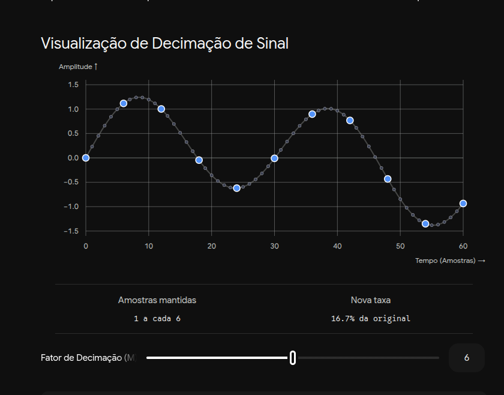

# Decimador

Um **decimador** (ou processo de decimação) em processamento digital de sinais é, de forma muito direta, o ato de **reduzir a taxa de amostragem** de um sinal digital.

Se você tem um conversor analógico-digital (ADC) amostrando um sinal a 100 MHz, mas a informação útil que você precisa analisar só varia na faixa de 1 MHz, processar dados a 100 MHz é um desperdício enorme de poder computacional. O decimador reduz essa montanha de dados para uma taxa menor e mais gerenciável.

A decimação real em DSP sempre ocorre em **duas etapas obrigatórias** (e é aqui que ela se conecta com a nossa conversa anterior):

### 1. Filtragem Anti-aliasing (Onde entra o Filtro FIR)

Antes de reduzir a taxa de amostragem, você **precisa** remover as altas frequências do sinal. Se você simplesmente jogar amostras fora sem filtrar antes, o ruído de alta frequência vai se "dobrar" para cima das frequências baixas (um fenômeno chamado *Aliasing*), destruindo completamente a sua informação útil.

Portanto, a primeira metade de um decimador é quase sempre um **Filtro FIR passa-baixa**.

### 2. Downsampling (Compressão da taxa)

Depois que o filtro limpou as altas frequências, o sistema simplesmente descarta amostras. Se o seu **Fator de Decimação ($M$)** for 4, o sistema vai manter a 1ª amostra, jogar fora a 2ª, 3ª e 4ª, manter a 5ª, e assim por diante.

A nova taxa de amostragem será a taxa original dividida por $M$ ($f_s / M$).

### Por que isso é crucial em FPGAs?

Em projetos de hardware, os recursos físicos são finitos. Reduzir a taxa de amostragem o mais cedo possível na sua cadeia de processamento traz benefícios gigantescos:

- **Economia de DSP Slices:** Fatias de processamento digital (como os blocos DSP48 em Xilinx) são recursos valiosos. Processar menos amostras por segundo significa que você pode multiplexar o mesmo multiplicador de hardware para fazer várias contas diferentes, economizando área física no chip.
- **Fechamento de Timing (*Timing Closure*):** Fazer um sinal cruzar toda a lógica da FPGA em frequências muito altas (ex: 200 MHz) torna difícil garantir que os dados cheguem aos registradores a tempo. Decimando o sinal logo na entrada, o resto da sua arquitetura pode rodar em um domínio de clock muito mais lento e tranquilo (ex: 50 MHz).
- **Menor Consumo de Energia:** Menos transições lógicas por segundo = menos energia dissipada em calor.

### A "Mágica" da Implementação: Estruturas Polifásicas

Se você implementar a matemática de forma ingênua, você faria o filtro FIR calcular todas as amostras de saída e, em seguida, um bloco de lógica jogaria $M-1$ dessas amostras no lixo. Isso significa que a sua FPGA gastou energia e multiplicadores calculando valores que nunca serão usados.

Ao usar ferramentas de geração de IP (como o *FIR Compiler* do Vivado), o software implementa uma arquitetura chamada **Filtro Polifásico**. Em vez de calcular tudo, a lógica de hardware é dividida e rearranjada para que as multiplicações do filtro FIR só ocorram para as amostras que efetivamente vão ser mantidas. É uma otimização brutal de hardware.

